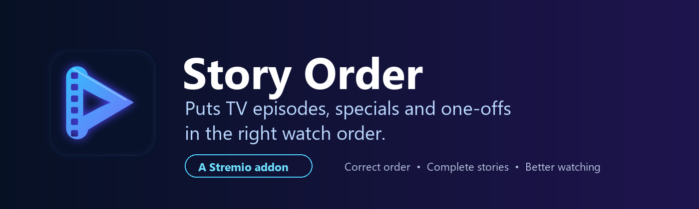
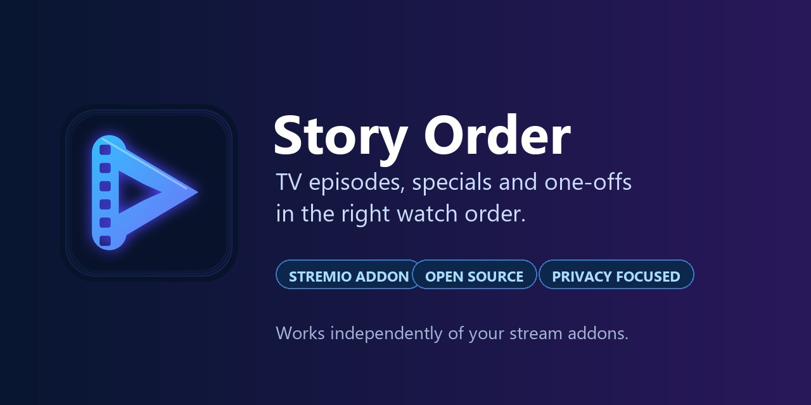
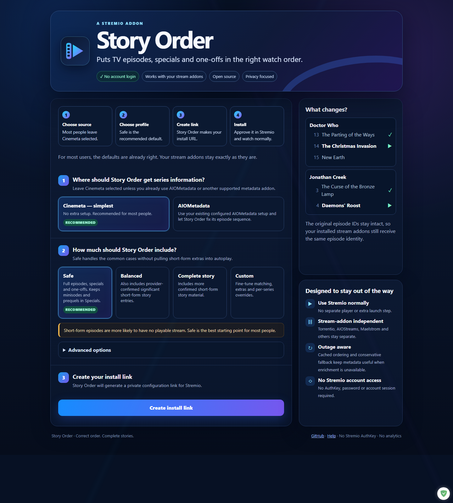

# Story Order

<p align="center"></p>

[](https://github.com/ThiaJay/stremio-story-order/actions/workflows/ci.yml) [](https://github.com/ThiaJay/stremio-story-order/releases) [](LICENSE)

**Configure / install:** https://stremio-story-order.storyorder.workers.dev/configure
**Default standalone manifest:** https://stremio-story-order.storyorder.workers.dev/manifest.json

## Graphics

<p align="center"></p>

<p align="center"></p>

The complete public graphics pack is in [`public/branding`](public/branding) and [`public/screenshots`](public/screenshots). See [`BRANDING.md`](BRANDING.md) for intended uses.

## Quick start - most people

1. Open the **Configure / install** link above.
2. Leave **Cinemeta** selected as the metadata source.
3. Leave **Safe** selected as the ordering profile.
4. Click **Create install link**.
5. Click **Install Story Order** and approve it in Stremio.
6. Keep your stream addons such as Torrentio, AIOStreams or Maelstrom installed exactly as they are.

That is all most users need to do. Open a TV series normally and Story Order will place supported specials and one-offs into the episode sequence automatically.

### If you already use AIOMetadata or another metadata addon

Choose that source on the Configure page instead of Cinemeta. For the corrected episode list to win, **Story Order must be ahead of the metadata addon it is replacing/wrapping**, or you should use the Story Order copy of that metadata source rather than the duplicate original entry. Stream addons do not need to move.

### After installation

There is no separate player and nothing to start manually. Story Order changes the episode list Stremio sees. When a supported special or one-off belongs between normal episodes, it appears in that position and autoplay can continue through it.

**Puts TV episodes, specials and one-offs in the right watch order.**

Story Order fixes TV episode order in Stremio. It places specials, feature-length one-offs and other misplaced episodes where they belong so they appear and autoplay in the proper sequence.

It is **not a stream addon**. It works independently of Torrentio, AIOStreams, Maelstrom and other stream addons, which can be installed in any combination.

## What it fixes

Stremio metadata commonly places Christmas specials, feature-length one-offs and other narrative episodes in Season 0. Autoplay then jumps from the last normal episode straight to the next numbered season.

Story Order distinguishes narrative candidates from obvious ancillary material. Panels, behind-the-scenes programmes, explicit **Episode Insider** entries and season/series retrospectives such as "Inside ... Season 2" stay outside the narrative ordering candidates by default.

Story Order can place those existing entries into the normal sequence without changing their underlying IDs. For example, a display entry may become Season 1 Episode 14 while its stream-facing ID remains `tt...:0:2`.

The engine also handles normal episodes that a source has misclassified into Season 0 and post-series feature-length episodes such as *Jonathan Creek: Daemons' Roost*.

## Metadata sources

- **Cinemeta** - zero-setup standalone mode and the recommended first community setup.
- **AIOMetadata** - wrap an existing configured ElfHosted AIOMetadata manifest without keeping a duplicate metadata addon installed.
- **Custom Stremio metadata addon** - supported by the architecture. The hosted service keeps this behind a server allowlist to prevent SSRF abuse; self-hosters can explicitly enable trusted hosts.

The ordering layer is the same in every mode.

## Ordering profiles

- **Safe** - full-length narrative entries and high-confidence regular-episode repairs. Short-form extras stay in Specials.
- **Balanced** - additionally includes provider-confirmed significant short-form story entries.
- **Complete story** - includes all provider-confirmed short-form story entries allowed by the other safety switches.
- **Custom** - exposes runtime thresholds, insignificant-special handling, non-story extras, future entries and per-series overrides.
## Outage behaviour

Ordering enrichment currently uses TVmaze. Successful public ordering data is cached. If TVmaze is unavailable, Story Order uses stale cached enrichment when available and then falls back to conservative date/runtime inference from the chosen metadata source.

For the metadata source itself, successful movie/series metadata may be cached for outage recovery. User-specific catalogue responses are deliberately **not** persisted. If a non-Cinemeta source is unavailable and an IMDb-addressable movie or series has no usable cached response, Story Order can fall back to Cinemeta metadata.

A stream-provider outage is separate. Story Order preserves video IDs, so every installed stream addon can still try to resolve the same episode. An independent metadata addon cannot know whether another installed stream addon currently has a playable copy; Safe mode therefore avoids short-form entries most likely to have poor stream coverage.

## What Story Order will not silently do

Story Order never creates or deletes video identities during automatic ordering. Provider-only episodes that do not exist in the selected metadata source are not synthesized.

That rule matters for standalone films or TV movies connected to a series. Injecting a separate movie identity into a series can make Stremio ask stream addons using the wrong media type. Cross-title linking will only be added after a stream-compatible representation is proven.

## Manual overrides

The hosted configuration page includes a guarded per-series override helper, so most users do not need to write JSON. Enter the series IMDb ID, the existing stable video ID and choose Include or Exclude. Include rules can optionally set a target season or a before or after anchor. The helper writes the equivalent advanced JSON for review before installation.

Advanced configuration still accepts per-series overrides keyed by IMDb series ID. An existing Season 0 video can be excluded from automatic insertion or explicitly included with a target season or a `beforeId`/`afterId` anchor.

Overrides still preserve the original video ID and cannot invent a missing video.

Example:

```json
{
  "tt1234567": {
    "exclude": ["tt1234567:0:4"],
    "include": [{"id":"tt1234567:0:7","targetSeason":3}]
  }
}
```
## Privacy and security

- No Stremio AuthKey is requested or required.
- No Stremio account credentials are stored.
- Configuration is encrypted into the install URL with AES-GCM; the hosted service does not maintain a configuration database.
- The public hosted service only accepts curated metadata-source patterns by default.
- Localhost, IP-address targets, non-HTTPS sources, path traversal and upstream redirects are rejected.
- Response sizes and upstream request times are bounded.
- No application analytics or telemetry are implemented.
- Personal catalogue responses are pass-through only and are not written to persistent Story Order cache.

See `SECURITY.md` and `PRIVACY.md` for the release threat model.

## Android client integration

A public stable ID client contract and acceptance fixture for Android mobile and Android TV or Fire TV are available in [docs/ANDROID-INTEGRATION.md](docs/ANDROID-INTEGRATION.md). The reference is presentation only and preserves canonical watched identity.

## Cross title story references

A safe, disabled-by-default cross title presentation contract is documented in [docs/CROSS-TITLE-INTEGRATION.md](docs/CROSS-TITLE-INTEGRATION.md). It models films and separate titles as navigation references rather than synthetic series episodes. Story Order does not publish this hint in production until a client proves media-type switching, watched-state isolation and Continue Watching isolation.

## Development

Requires Node.js 22+.

```text
npm install --ignore-scripts
npm run test
npm run test:live
```

`test:live` contacts public Cinemeta and TVmaze. The deterministic test suites do not require the user's Stremio account.

For Cloudflare self-hosting, copy `wrangler.example.toml` to `wrangler.local.toml`, create the optional `STORY_CACHE` KV namespace and set a 32-byte base64url `CONFIG_SECRET` using Wrangler secrets.

### Self-hosting placeholders

Hosted users do not need to replace anything in the repository. The following values are only for people deploying their own Worker:

| Example/config value | What it means |
| --- | --- |
| `<your namespace id>` in `wrangler.example.toml` | Replace this with the KV namespace ID printed by `wrangler kv namespace create STORY_CACHE`. Leave the whole `[[kv_namespaces]]` block out if you intentionally run without cache. |
| `CONFIG_SECRET` | A deployment secret you create yourself. Run `wrangler secret put CONFIG_SECRET` and enter a random 32-byte base64url value. Never commit it. |
| `ENABLE_CUSTOM_UPSTREAM` | Leave `false` unless the operator deliberately wants to allow custom metadata hosts. |
| `ALLOWED_UPSTREAM_HOSTS` | A comma-separated allowlist of trusted public metadata hostnames. Leave empty when custom upstreams are disabled. |

Test-only hosts such as `*.example.com` and `demo-aiometadata.elfhosted.com` are synthetic fixtures and are not production configuration to copy.

## Service status

The hosted configuration page includes a privacy-safe live capability check backed by `/_story/status.json`. It reports the Story Order version, the stable-ID presentation contract and the watched-identity safety guarantees. It does not expose account data, catalogue contents, Stremio credentials or user configuration.

## Current release status

**1.0.14 is the current production release.** It combines the refreshed Story Order identity and configure page with the guarded per-series override helper, the stable-ID presentation contract and the privacy-safe capability status. Production acceptance completed on 24 September 2026. The deployed Worker bundle matched SHA-256 `d9a646227ba34547279d25040452db7ad81e49ceb00af4d36628f9a63c4ac414` and the public manifest reported 1.0.14. Canonical video IDs and season or episode coordinates remain unchanged. The hosted configuration page is https://stremio-story-order.storyorder.workers.dev/configure and the default standalone manifest is https://stremio-story-order.storyorder.workers.dev/manifest.json.

TVmaze data is used for ordering enrichment and should be attributed in accordance with TVmaze's terms/licensing.